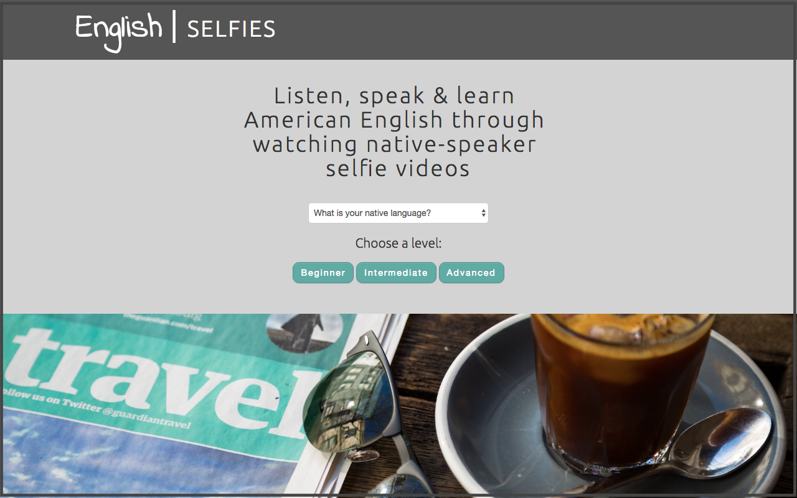
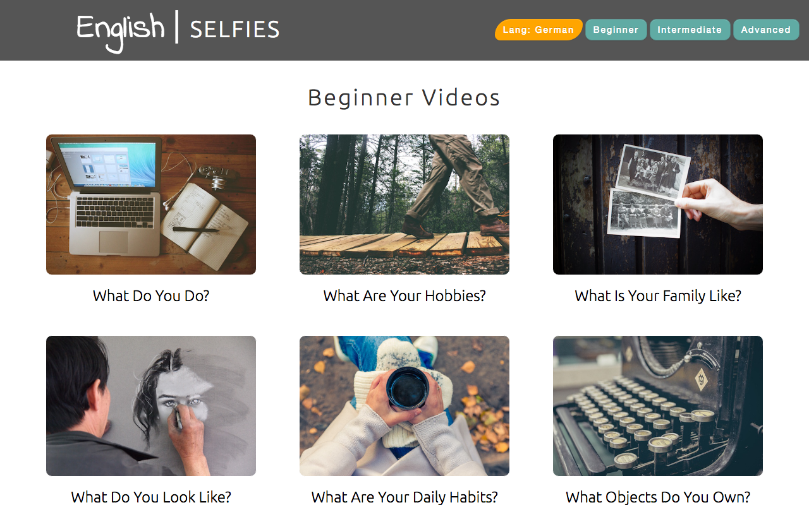
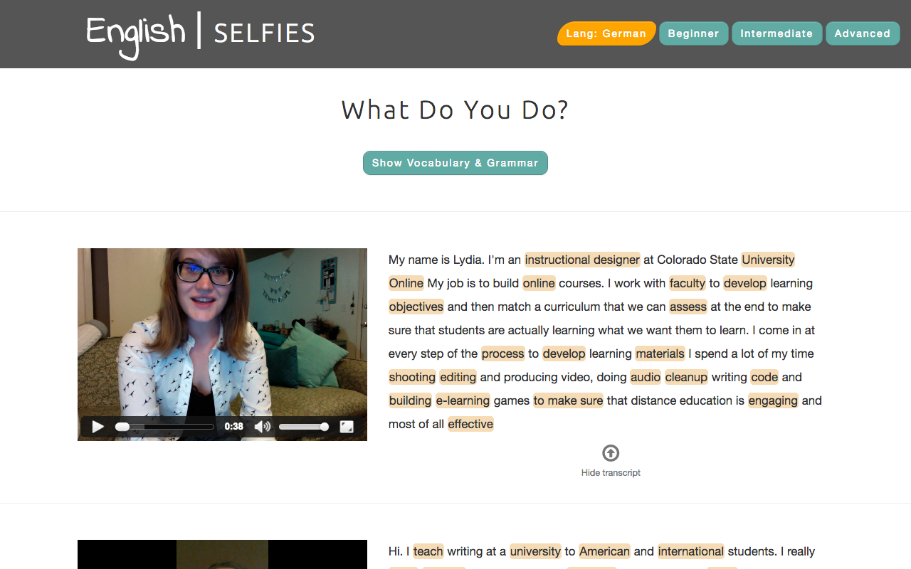
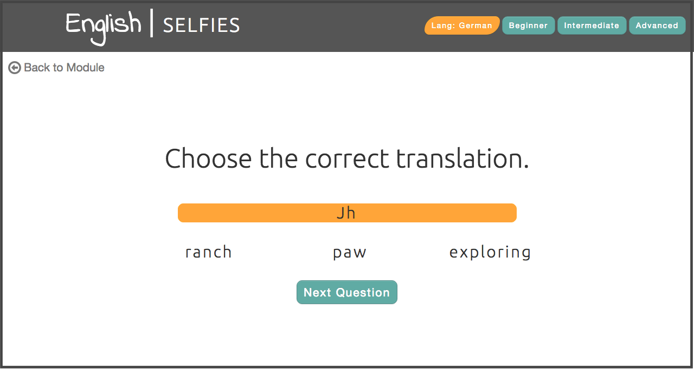

#English Selfies

The [English Selfies](http://kfoster-marks.github.io/english-selfie-learning-site/) site was built to be a resource for English-language learners (ELLs) from a variety of language backgrounds.

Upon entering the site, an ELL user is asked to input his or her native language, which is used throughout the site to perform translations using the [Yandex Translate API](https://translate.yandex.com/developers) from English to the user's native language. The user is then prompted to identify as a beginner, intermediate or advanced learner in order to direct him/her to the appropriate proficiency page.

On the selected proficiency page, the user can access modules organized by communicative task (i.e., discussing one's job).

Once a user has selected a module to study, the user is directed to a page that contains a series of videos recorded by native speakers of English. These videos are transcribed, and content-vocabulary is highlight and translated to the user's native language on hover. Users have the ability to expand a vocabulary/grammar description meant to help them understand the speakers' language.

For any communicative task module, users can elect to take a vocabulary quiz. This quiz randomly selects vocabulary from that highlighted on the corresponding module page, and using the Yandex Translation API, asks users to correctly choose a translation of one of these vocabulary words. Upon completion of the quiz, users are given feedback on their score and suggestions for future study.

